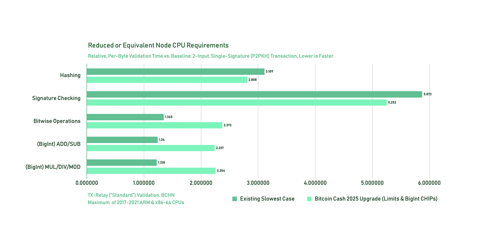
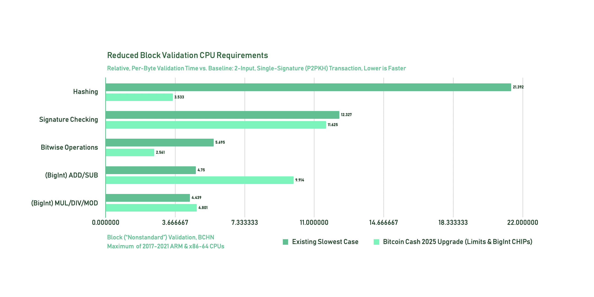
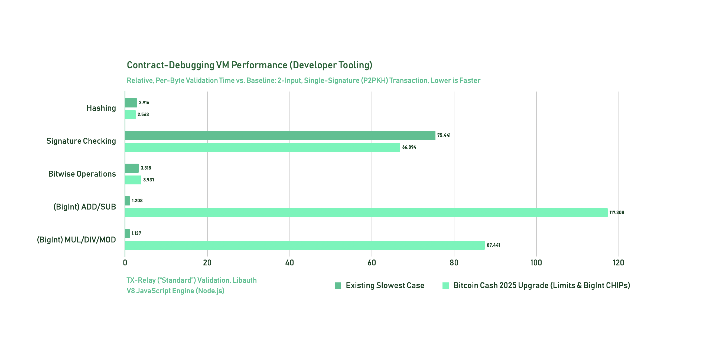

# Tests & Benchmarks

**This proposal includes over 36,000 cross-implementation Virtual Machine Bytecode (VMB) test vectors and performance benchmarks** including:

1. a full, encoded test transaction, and
2. An encoded set of UTXOs with which to validate the transaction.

## Testing

For ease of use, VMB tests are divided into directories by annual Virtual Machine (VM) version and expected evaluation result. All tests in each directory must be evaluated against both VM modes for that annual VM version, and validation performance measured relative to the [baseline test]()

Six directories of tests are available for each VM corresponding with the modes in which the contained tests should be run (e.g. [`bch_2025_standard`](./vmb_tests/bch_2025_standard/)):

- **`standard`** – these tests must pass in both standard and nonstandard mode.
- **`nonstandard`** – these tests must pass in nonstandard mode but fail in standard mode.
- **`invalid`** – these tests must fail in both standard and nonstandard mode.

<details>
<summary>Standard Vs. Nonstandard VMs</summary>

### Standard Vs. Nonstandard VMs

The Bitcoin Cash virtual machine has two modes: `standard` ([introduced in 2010](https://gitlab.com/bitcoin-cash-node/bitcoin-cash-node/-/commit/a206a23980c15cacf39d267c509bd70c23c94bfa)) and `nonstandard` mode.

The **`standard` mode** should be used by practically all applications. It is the strictest mode of operation, and it is used to validate transactions before accepting or relaying them over the P2P network.

The **`nonstandard` mode** is slightly more lax, and is only used to validate newly mined blocks. Because they cannot typically be relayed, nonstandard transactions must be manually included by a miner. By definition, any transaction that is valid in standard mode should also be valid in nonstandard mode.

This distinction between standard and nonstandard modes offers the network [defense in depth](<https://en.wikipedia.org/wiki/Defense_in_depth_(computing)>) against various kinds of attacks.

For example, it's possible to prepare thousands of UTXOs with nonstandard locking scripts that can be unlocked using very small (non-P2SH) transactions but require unusually excessive resources to validate. If these nonstandard redeem transactions were relayed and automatically accepted by a miner, the miner could inadvertently create an unusually slow-to-validate block. If another block is found before most miners are able to validate the slow-to-validate block, the first miner's hashing power would be wasted (and they would lose mining revenue).

By maintaining this standard/nonstandard distinction, the BCH ecosystem retains the flexibility to experiment with unusual, nonstandard transactions while ensuring such activity is unlikely to negatively impact honest miners or the wider network.

</details>

### VMB Test Contents

Each VMB test (found in `*.vmb_tests.json` files) is an array including:

0. **`shortId`** - A short, unique identifier for the test (based on the hash of the test contents)
1. **`testDescription`** - A string describing the purpose/behavior of the test
2. **`unlockingScriptAsm`** - The unlocking script under test (disassembled, i.e. human-readable)
3. **`redeemOrLockingScriptAsm`** - The locking script under test (disassembled)
4. **`testTransactionHex`** - The full, encoded test transaction
5. **`sourceOutputsHex`** - An encoded list of unspent transaction outputs (UTXOs) with which to verify the test transaction (ordered to match the input order of the test transaction)
6. **`inputIndex` (default: `0`)** - The input index of the primary input under test (evaluating the scripts from array index `2` and `3` above); if not specified, the primary input under test is input `0`.

Co-located with each `*.vmb_tests.json` file are a variety of ancillary files to assist in verifying implementations:

- **`*.[non]standard_results.json`** – A JSON object mapping VMB test `shortId`s to an expected result for the specified evaluation mode, either `true` or a `string` describing the expected rejection reason. Note that failure reasons are provided as a debugging tool – some transactions necessarily have two or more flaws, and the order in which certain validations are applied is not consensus critical.

- **`*.[non]standard_limits.json`** – a JSON object mapping VMB test `shortId`s to an array of resulting VM metrics for further verification: `[densityControlLength: number, maximumOperationCost: number, operationCost: number, description: string]`. All implementations should verify that their computed `operationCost` following a successful evaluation is exactly equal to this number. **The tests are designed to identify any deviations from the spec using only `operationCost`**, but some implementations may choose to also verify other stats or limits. Note that **the precise `operationCost` values of rejected tests are not consensus critical**. Some implementations may reject invalid transactions more eagerly than others based on implementation optimizations creating minor differences in computed totals.

- **`*.[non]standard_stats.csv`** – A CSV file providing a variety of expected VM metrics following each test evaluation. This file is a tool for researchers to more easily review test behaviors and analyze benchmarking results.

## Benchmarks

In addition to functional testing, the validation speed of all test vectors should be benchmarked to detect performance regressions in any portion of the tested VM implementation.

**The provided test vectors include both functionally-focused tests and tests intending to maximize worst-case performance across a variety of metrics.**

Note that in addition to comprehensive benchmarks, this proposal maintains [significant safety margins](./risk-assessment.md) and uses several [defense-in-depth strategies](/risk-assessment.md) to reduce the risk that subsets of unexpectedly-poor performance in a particular node implementation become practically exploitable.

### Baseline Benchmark

Benchmark should measure the the time taken by the VM implementation to accept or reject the tested transaction. Each test set includes a single baseline benchmark (ID: `trxhzt`) marked with the string `[baseline]` in it's description: `Transaction validation benchmarks: [baseline] 2 P2PKH inputs, 2 P2PKH outputs (one Schnorr signature, one ECDSA signature) (nonP2SH)`.

The baseline benchmark is a 366-byte transaction considered to be as "average" as possible: 2 common single-signature inputs (one for each signature validation algorithm), and 2 single-signature outputs.

The baseline benchmark is useful for evaluating benchmarking results across implementations: while some implementations are faster than others, the relative performance ratios between different categories of benchmarks can be expected to remain fairly consistent across all implementations.

# Evaluation of Results

This proposal carefully identifies and measures a variety of existing worst-case performance scenarios, ensuring all re-targeted limits are established as closely as possible to existing practical limits:

- **Limitation of Pushed Bytes** - This proposal comprehensively limits sub-linear and linear-time operations (bitwise operations, VM number decoding, `OP_DUP`, `OP_EQUAL`, `OP_REVERSEBYTES`, etc.) by limiting the total density of bytes pushed to the stack. This reduces system complexity and offers defense-in-depth by ensuring that any source of linear time complexity in any operation (e.g. due to a defect in a particular VM implementation) cannot create practically-exploitable performance issues. See [Rationale: Limitation of Pushed Bytes](./rationale.md#limitation-of-pushed-bytes).

- **Base Instruction Cost** – To further minimize the impact of all possible sub-linear and linear-time implementation defects, this proposal also comprehensively limits the overall density of evaluated (both executed and not executed) instructions, aiming to ensure that operation density following this upgrade increases by less than one order of magnitude. See [Rationale: Selection of Base Instruction Cost](./rationale.md#selection-of-base-instruction-cost).

- **Arithmetic Limits** – This proposal limits both expensive arithmetic operations (`OP_MUL`, `OP_DIV`, and `OP_MOD`) and VM number re-encoding based on the worst-case performance of an un-optimized implementation. This avoids creating additional implementation burdens on most VM implementations, as arithmetic operations can be internally implemented using a wide range of existing big-integer libraries or built-in language features. Of course, as the Bitcoin Cash VM number encoding is specifically designed to efficiently support in-place, arbitrary-precision arithmetic (without significant encoding/decoding cost), highly-optimized implementations will be capable of performance far exceeding the minimal acceptable level. E.g. [worst-case arithmetic in BCHN is ~10x faster](#bitcoin-cash-node-c) than worst-case 1-of-3 bare multisig (the primary performance bottleneck both before and after this proposal).

- **Hashing Limits** – Unlike other re-targeted limits, the hashing limits established by this proposal disallow some additional, [provably-malicious cases](./rationale.md#selection-of-hashing-limit) (though all currently-standard transactions remain valid), reducing the worst-case performance in some implementations and [expanding the node performance safety margin](./risk-assessment.md#expanded-node-performance-safety-margin) in hashing-expensive scenarios.

- **Signature Checking Limits** – This proposal applies the existing signature checking limit within the [unified operation cost](./rationale.md#unification-of-limits-into-operation-cost) to prevent worst-case scenarios from maximizing validation cost across both limits. Additionally, the [hashing limit](./readme.md#hashing-limit) is applied during signing serialization to [prevent abuse of hashing within signature checks](./rationale.md#exclusion-of-signing-serialization-components-from-hashing-limit).

Empirical verification confirms that these analytically-established limits **successfully expand the power and flexibility of Bitcoin Cash's contract system without negatively impacting the CPU requirements of Bitcoin Cash nodes**.

Additional, implementation-specific notes and CHIP maintainer-reproduced results are also provided below.

## Bitcoin Cash Node (C++)

[Bitcoin Cash Node (BCHN)](https://bitcoincashnode.org/) is currently the most popular node implementation among Bitcoin Cash miners and users. The below results analyze [raw performance data sets](./benchmarks/bchn/) from a representative sample of consumer hardware across multiple architectures and with release dates ranging from `2017` to `2021` – a target range this proposal considers ideal for empirical verification of wide-ranging node performance safety.

To ensure continued operation, full nodes must always retain enough excess compute capacity to handle worst-case spikes in validation requirements.

Overall, the proposed changes either minimally reduce or have no impact on node CPU requirements:



<details>

<summary>Source Data for Figure</summary>

The following worst-case results for each category have been extracted from the [tracked benchmark data sets](./benchmarks/bchn/). Note that the worst-case relative performance, across all tested machines, is graphed for each category.

#### 2023 Standard, BCHN, `i9-10980HK` (`x86-64`)

| Category           | ID     | TxByteLen | RelCost  | RelCostPerByte | Hz      | AvgTimeNSec | VariancePct | Samples | TestPack | OrigStd | UsedStd | ErrMsg | Description                                                                                                                                   |
| ------------------ | ------ | --------- | -------- | -------------- | ------- | ----------- | ----------- | ------- | -------- | ------- | ------- | ------ | --------------------------------------------------------------------------------------------------------------------------------------------- |
| Abusive Hashing    | lcennk | 99966     | 825.733  | 3.023210       | 15.5    | 64712386    | 0.9         | 50      | 2023     | S       | S       | "OK"   | "Within BCH_2023_05 P2SH20/standard limits, maximize hash digests per byte, then total bytes OP_HASH256 hashed (packed transaction) (P2SH20)” |
| Signature Checking | l0fhm3 | 99988     | 1374.529 | 5.031380       | 9.3     | 107721338   | 0.9         | 50      | 2023     | S       | S       | "OK"   | "Within BCH_2023_05 standard limits, packed 1-of-3 bare multisig inputs, 1 output (all ECDSA signatures bottom slot) (nonP2SH)”               |
| Bitwise Ops        | pxknd8 | 268       | 0.985    | 1.345465       | 12951.7 | 77210       | 2.2         | 18655   | 2023     | S       | S       | "OK"   | "Within BCH_2023_05 P2SH/standard, single-input limits, maximize OP_AND (P2SH20)”                                                             |
| OP_ADD/SUB         | ujl8f6 | 217       | 0.490    | 0.825867       | 26059.3 | 38373       | 1.4         | 23040   | 2023     | S       | S       | "OK"   | "OP_ADD 1-byte number (highest-bit set) and 1-byte number (highest-bit set) (P2SH32)"                                                         |
| MUL/MOD/DIV        | djke9j | 217       | 0.488    | 0.823604       | 26130.9 | 38268       | 1.9         | 23040   | 2023     | S       | S       | "OK"   | "OP_MUL 1-byte number (highest-bit set) and 1-byte number (highest-bit set) (P2SH20)"                                                         |

#### 2025 Standard, BCHN, `i9-10980HK` (`x86-64`)

| Category           | ID     | TxByteLen | RelCost  | RelCostPerByte | Hz      | AvgTimeNSec | VariancePct | Samples | TestPack | OrigStd | UsedStd | ErrMsg                          | Description                                                                                                                                |
| ------------------ | ------ | --------- | -------- | -------------- | ------- | ----------- | ----------- | ------- | -------- | ------- | ------- | ------------------------------- | ------------------------------------------------------------------------------------------------------------------------------------------ |
| Abusive Hashing    | ta05ww | 99966     | 203.758  | 0.746009       | 62.7    | 15957514    | 1.1         | 50      | 2025     | N       | S       | "Hash iteration limit exceeded" | "Within BCH_2023_05 P2SH20/standard limits maximize hash digests per byte then total bytes OP_SHA256 hashed (packed transaction) (P2SH32)” |
| Signature Checking | l0fhm3 | 99988     | 1380.407 | 5.052898       | 9.3     | 108107815   | 0.9         | 50      | 2025     | S       | S       | "OK"                            | "Within BCH_2023_05 standard limits, packed 1-of-3 bare multisig inputs, 1 output (all ECDSA signatures, bottom slot) (nonP2SH)”           |
| Bitwise Ops        | 4wm0d3 | 69        | 0.447    | 2.372506       | 28547.9 | 35028       | 1.4         | 72465   | 2025     | S       | S       | "OK"                            | "Within BCH_2025_05 P2SH/standard, single-input limits, maximize OP_AND (P2SH20)”                                                          |
| OP_ADD/SUB         | 09macl | 183       | 1.127    | 2.253786       | 11331.0 | 88253       | 1.4         | 27320   | 2025     | S       | S       | "OK"                            | "Within BCH_2025_05 P2SH20/standard single-input limits balance (OP_DUP OP_CAT) OP_ADD density and operand bytes (P2SH20)”                 |
| MUL/MOD/DIV        | u83yzg | 73        | 0.446    | 2.237338       | 28613.9 | 34948       | 1.4         | 68495   | 2025     | S       | S       | "OK"                            | "Within BCH_2025_05 P2SH/standard single-input limits maximize 1-byte OP_MOD (1-by-10000 byte) (highest byte set) (P2SH32)”                |

#### 2023 Standard, BCHN, `i7-8700K` (`x86-64`)

| Category           | ID     | TxByteLen | RelCost  | RelCostPerByte | Hz      | AvgTimeNSec | VariancePct | Samples | TestPack | OrigStd | UsedStd | ErrMsg | Description                                                                                                                      |
| ------------------ | ------ | --------- | -------- | -------------- | ------- | ----------- | ----------- | ------- | -------- | ------- | ------- | ------ | -------------------------------------------------------------------------------------------------------------------------------- |
| Abusive Hashing    | cdr2df | 569       | 4.834    | 3.109109       | 2454.3  | 407452      | 34.0        | 8785    | 2023     | S       | S       | "OK"   | "Within BCH_2023_05 P2SH/standard, single-input limits, maximize bytes OP_HASH256 hashed (P2SH32)”                               |
| Signature Checking | l0fhm3 | 99988     | 1604.588 | 5.873495       | 7.4     | 135261179   | 44.3        | 50      | 2023     | S       | S       | "OK"   | "Within BCH_2023_05 standard limits, packed 1-of-3 bare multisig inputs, 1 output (all ECDSA signatures, bottom slot) (nonP2SH)” |
| Bitwise Ops        | pxknd8 | 268       | 0.735    | 1.003315       | 16147.3 | 61929       | 7.0         | 18655   | 2023     | S       | S       | "OK"   | "Within BCH_2023_05 P2SH/standard, single-input limits, maximize OP_AND (P2SH20)”                                                |
| OP_ADD/SUB         | n6xue4 | 221       | 0.740    | 1.225582       | 16030.1 | 62382       | 1.0         | 22625   | 2023     | S       | S       | "OK"   | "OP_ADD 1-byte number (all bits set) and 1-byte number (all bits set) (P2SH20)"                                                  |
| MUL/MOD/DIV        | ens7pj | 221       | 0.749    | 1.240152       | 15841.8 | 63124       | 2.8         | 22625   | 2023     | S       | S       | "OK"   | "OP_MUL 1-byte number (all bits set) and 1-byte number (all bits set) (P2SH32)"                                                  |

#### 2025 Standard, BCHN, `i7-8700K` (`x86-64`)

| Category           | ID     | TxByteLen | RelCost | RelCostPerByte | Hz      | AvgTimeNSec | VariancePct | Samples | TestPack | OrigStd | UsedStd | ErrMsg | Description                                                                                                                      |
| ------------------ | ------ | --------- | ------- | -------------- | ------- | ----------- | ----------- | ------- | -------- | ------- | ------- | ------ | -------------------------------------------------------------------------------------------------------------------------------- |
| Abusive Hashing    | rnnrg8 | 68        | 0.095   | 0.509056       | 82171.5 | 12169       | 25.5        | 73530   | 2025     | S       | S       | "OK"   | "OP_HASH160 hash 1335 bytes (P2SH20)"                                                                                            |
| Signature Checking | l0fhm3 | 99988     | 895.477 | 3.277839       | 8.7     | 115223183   | 2.1         | 50      | 2025     | S       | S       | "OK"   | "Within BCH_2023_05 standard limits, packed 1-of-3 bare multisig inputs, 1 output (all ECDSA signatures, bottom slot) (nonP2SH)” |
| Bitwise Ops        | 7lm98w | 69        | 0.254   | 1.348610       | 30567.5 | 32714       | 4.8         | 72465   | 2025     | S       | S       | "OK"   | "Within BCH_2025_05 P2SH/standard, single-input limits, maximize OP_AND (P2SH32)”                                                |
| OP_ADD/SUB         | 2xhecr | 85        | 0.243   | 1.046402       | 31980.0 | 31269       | 5.3         | 58825   | 2025     | S       | S       | "OK"   | "Within BCH_2025_05 P2SH/standard, single-input limits, maximize OP_SUB operand bytes (P2SH32)”                                  |
| MUL/MOD/DIV        | u83yzg | 73        | 0.311   | 1.560590       | 24968.0 | 40051       | 61.4        | 68495   | 2025     | S       | S       | "OK"   | "Within BCH_2025_05 P2SH/standard, single-input limits, maximize 1-byte OP_MOD (1-by-10000 byte) (highest byte set) (P2SH32)”    |

</details>

Further, block validation CPU requirements are reduced by approximately `50%`:



<details>

<summary>Source Data for Figure</summary>

The following worst-case results for each category have been extracted from the [tracked benchmark data sets](./benchmarks/bchn/). Note that the worst-case relative performance, across all tested machines, is graphed for each category.

#### 2023 Nonstandard, BCHN, `i9-10980HK` (`x86-64`)

| Category           | ID     | TxByteLen | RelCost | RelCostPerByte | Hz      | AvgTimeNSec | VariancePct | Samples | TestPack | OrigStd | UsedStd | ErrMsg                                                                             | Description                                                                                               |
| ------------------ | ------ | --------- | ------- | -------------- | ------- | ----------- | ----------- | ------- | -------- | ------- | ------- | ---------------------------------------------------------------------------------- | --------------------------------------------------------------------------------------------------------- |
| Abusive Hashing    | n4qn5c | 65        | 3.799   | 21.391557      | 3358.7  | 297729      | 2.3         | 76925   | 2023     | N       | N       | "OK"                                                                               | "Within BCH_2023_05 nonP2SH/nonstandard, single-input limits, maximize bytes OP_HASH160 hashed (nonP2SH)” |
| Signature Checking | c7ykrf | 358       | 11.343  | 11.595973      | 1125.0  | 888908      | 1.6         | 13965   | 2023     | I       | N       | "Signature must be zero for failed CHECK(MULTI)SIG operation"                      | "2-of-20 multisig with checkBits of zero (ECDSA, key 13 and key 13) (nonP2SH)”                            |
| Bitwise Ops        | vg22ge | 65        | 1.011   | 5.694777       | 12616.6 | 79260       | 2.3         | 76925   | 2023     | I       | S       | "Script evaluated without error but finished with a false/empty top stack element" | "Within BCH_2023_05 P2SH/standard, single-input limits, maximize OP_XOR (nonP2SH)”                        |
| OP_ADD/SUB         | u33zrd | 67        | 0.813   | 4.439296       | 15712.4 | 63644       | 0.4         | 74625   | 2025     | N       | S       | "OK"                                                                               | "Within BCH_2023_05 nonP2SH/nonstandard, single-input limits, maximize OP_ADD (nonP2SH)"                  |
| MUL/MOD/DIV        | snngzt | 65        | 0.844   | 4.749977       | 15136.5 | 66065       | 2.9         | 76925   | 2025     | N       | S       | "OK"                                                                               | "Within BCH_2023_05 P2SH/standard, single-input limits, maximize OP_MUL (nonP2SH)”                        |

#### 2025 Nonstandard, BCHN, `i9-10980HK` (`x86-64`)

| Category           | ID     | TxByteLen | RelCost | RelCostPerByte | Hz      | AvgTimeNSec | VariancePct | Samples | TestPack | OrigStd | UsedStd | ErrMsg                                                                             | Description                                                                                                                                  |
| ------------------ | ------ | --------- | ------- | -------------- | ------- | ----------- | ----------- | ------- | -------- | ------- | ------- | ---------------------------------------------------------------------------------- | -------------------------------------------------------------------------------------------------------------------------------------------- |
| Abusive Hashing    | f706dv | 65        | 0.627   | 3.532896       | 20351.1 | 49137       | 3.0         | 76925   | 2025     | N       | N       | "OK"                                                                               | "OP_SHA256 hash 9976 bytes (nonP2SH)"                                                                                                        |
| Signature Checking | t29ktg | 358       | 11.371  | 11.625265      | 1122.9  | 890542      | 2.8         | 13965   | 2025     | I       | N       | "Signature must be zero for failed CHECK(MULTI)SIG operation"                      | "2-of-20 multisig with checkBits of zero (ECDSA, key 20 and key 13) (nonP2SH)”                                                               |
| Bitwise Ops        | ss9tws | 65        | 0.455   | 2.560708       | 28077.5 | 35615       | 0.5         | 76925   | 2025     | I       | S       | "Script evaluated without error but finished with a false/empty top stack element" | "Within BCH_2025_05 P2SH/standard, single-input limits, maximize OP_XOR (nonP2SH)”                                                           |
| OP_ADD/SUB         | nevxwn | 1315      | 31.901  | 8.878946       | 400.3   | 2498364     | 1.7         | 3800    | 2025     | N       | N       | "OK"                                                                               | "Within BCH_2025_05 nonP2SH/nonstandard, single-input limits, maximize control stack and stack usage checking (OP_NOTIF, OP_1ADD) (nonP2SH)" |
| MUL/MOD/DIV        | snngzt | 65        | 0.853   | 4.801359       | 14974.5 | 66779       | 1.9         | 76925   | 2025     | N       | N       | "OK"                                                                               | "Within BCH_2023_05 P2SH/standard, single-input limits, maximize OP_MUL (nonP2SH)”                                                           |

#### 2023 Nonstandard, BCHN, `i7-8700K` (`x86-64`)

| Category           | ID     | TxByteLen | RelCost | RelCostPerByte | Hz      | AvgTimeNSec | VariancePct | Samples | TestPack | OrigStd | UsedStd | ErrMsg                                                        | Description                                                                                               |
| ------------------ | ------ | --------- | ------- | -------------- | ------- | ----------- | ----------- | ------- | -------- | ------- | ------- | ------------------------------------------------------------- | --------------------------------------------------------------------------------------------------------- |
| Abusive Hashing    | vdqk6h | 65        | 3.772   | 21.237748      | 3145.2  | 317943      | 23.6        | 76925   | 2023     | N       | N       | "OK"                                                          | "Within BCH_2023_05 nonP2SH/nonstandard, single-input limits, maximize bytes OP_HASH256 hashed (nonP2SH)” |
| Signature Checking | vh54kr | 358       | 12.057  | 12.326580      | 983.9   | 1016375     | 26.9        | 13965   | 2023     | I       | N       | "Signature must be zero for failed CHECK(MULTI)SIG operation" | "2-of-20 multisig with checkBits of zero (ECDSA, key 20 and key 20) (nonP2SH)”                            |
| Bitwise Ops        | kxnn8r | 68        | 0.733   | 3.944885       | 16185.6 | 61783       | 11.4        | 73530   | 2023     | N       | N       | "OK"                                                          | "Within BCH_2023_05 nonP2SH/nonstandard, single-input limits, maximize OP_AND (nonP2SH)”                  |
| OP_ADD/SUB         | u33zrd | 67        | 0.411   | 2.243721       | 28882.0 | 34623       | 53.8        | 74625   | 2023     | N       | S       | "OK"                                                          | "Within BCH_2023_05 nonP2SH/nonstandard, single-input limits, maximize OP_ADD (nonP2SH)”                  |
| MUL/MOD/DIV        | deq7jk | 73        | 0.277   | 1.389821       | 42794.7 | 23367       | 7.0         | 68495   | 2023     | N       | S       | "OK"                                                          | "Within BCH_2023_05 P2SH/standard, single-input limits, maximize OP_MOD (nonP2SH)”                        |

#### 2025 Nonstandard, BCHN, `i7-8700K` (`x86-64`)

| Category           | ID     | TxByteLen | RelCost | RelCostPerByte | Hz      | AvgTimeNSec | VariancePct | Samples | TestPack | OrigStd | UsedStd | ErrMsg                                                                             | Description                                                                                                                                  |
| ------------------ | ------ | --------- | ------- | -------------- | ------- | ----------- | ----------- | ------- | -------- | ------- | ------- | ---------------------------------------------------------------------------------- | -------------------------------------------------------------------------------------------------------------------------------------------- |
| Abusive Hashing    | 0j2276 | 65        | 0.492   | 2.769390       | 15801.5 | 63285       | 45.6        | 76925   | 2025     | I       | N       | "Hash iteration limit exceeded"                                                    | "OP_HASH256 hash 10000 bytes (nonP2SH)"                                                                                                      |
| Signature Checking | ux6mm3 | 358       | 7.991   | 8.169586       | 972.6   | 1028223     | 39.0        | 13965   | 2025     | I       | S       | "VM cost limit exceeded"                                                           | "2-of-20 multisig with checkBits of zero (ECDSA, key 1 and key 13) (nonP2SH)"                                                                |
| Bitwise Ops        | am8mu9 | 69        | 0.401   | 2.124878       | 19400.5 | 51545       | 35.7        | 72465   | 2025     | I       | S       | "Script evaluated without error but finished with a false/empty top stack element" | "Within BCH_2025_05 P2SH/standard, single-input limits, maximize OP_XOR (P2SH20)”                                                            |
| OP_ADD/SUB         | nevxwn | 1315      | 23.906  | 6.653588       | 325.1   | 3075997     | 41.1        | 3800    | 2025     | N       | S       | "OK"                                                                               | "Within BCH_2025_05 nonP2SH/nonstandard, single-input limits, maximize control stack and stack usage checking (OP_NOTIF, OP_1ADD) (nonP2SH)" |
| MUL/MOD/DIV        | snngzt | 65        | 0.615   | 3.462931       | 12636.8 | 79133       | 48.0        | 76925   | 2025     | N       | N       | "OK"                                                                               | "Within BCH_2023_05 P2SH/standard, single-input limits, maximize OP_MUL (nonP2SH)”                                                           |

</details>

### Verification

To independently reproduce the [provided data sets](./benchmarks/) on a new target system, execute the following commands on the system to be tested:

```sh
git clone https://gitlab.com/cculianu/bitcoin-cash-node.git
cd bitcoin-cash-node
git checkout wip_new_vmb_bench_vmlimits_bigint
mkdir build
cd build
cmake -GNinja .. -DBUILD_BITCOIN_WALLET=OFF -DBUILD_BITCOIN_QT=OFF -DENABLE_NATPMP=OFF -DENABLE_MAN=OFF -DCMAKE_BUILD_TYPE=Release
ninja
ninja bench_bitcoin
# Requires ~6-24 hrs, produces 2 separate CSV lists:
./src/bench/bench_bitcoin -libauth=all_slow > log.txt
# To follow progress, in another session:
tail -f build/log.txt
```

The benchmarking executable will measure the performance of accepting or rejecting hundreds of GBs of densely-packed transactions including both intentionally-abusive transactions and a wide variety of typically-fast constructions.

## Libauth (JavaScript)

[Libauth](https://github.com/bitauth/libauth) is a popular TypeScript/JavaScript software development library for Bitcoin Cash. Libauth's Bitcoin Cash virtual machine implementations are designed to power interactive development tooling for Bitcoin Cash contract developers.

Libauth VMs must be sufficiently performant to avoid excessive resource consumption given a single abusive contract, e.g. if a developer opens a document with an intentionally malicious contract, the editing application does not lag or freeze. However, Libauth VMs are not currently employed in strongly-adversarial environments like fully-validating nodes (subject to flooding attacks).

Overall, the proposed changes approximately double the worst-case cost of debugging a malicious contract. Note that the Libauth project has publish [an explanation for the slowest performing benchmarks](https://github.com/bitauth/libauth/issues/145) attributing ~75% of total CPU activity to excessive object creation and garbage collection.



### Verification

To independently reproduce the [provided data sets](./benchmarks/) on a new target system, execute the following commands on the system to be tested:

```sh
git clone https://github.com/bitauth/libauth.git
git checkout 2025
yarn bench:vmb_tests # Approx. 5-10 hrs
yarn export:vmb_tests
```

The `bench:vmb_tests` command can be stopped and resumed at will, as baseline performance is regularly re-measured to correct for differences in base load on the target machine. Further information about produced files and benchmarking progress is logged by the command, and `export:vmb_tests` is a very fast process to accumulate all incrementally-produced results (see logs and Libauth's documentation for further detail).
